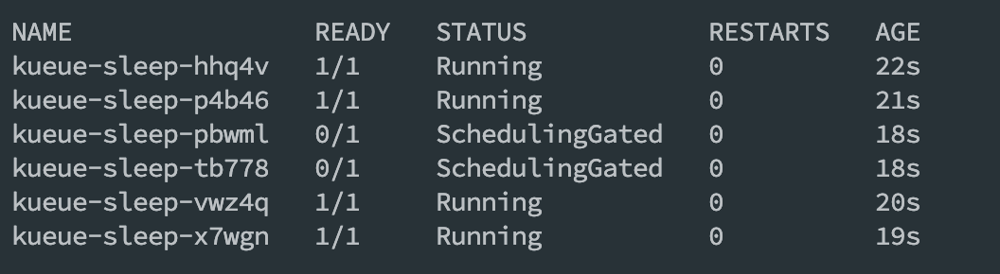

# kueue-demo
Kueued project demo

[Kueued](https://kueue.sigs.k8s.io/) is a cloud-native job queueing system for batch, HPC, AI/ML, and similar applications in a Kubernetes cluster.

This project is a demo that explain how to queue pods with kueue without using kubernetes jobs.   
You can get more information about Kueued using this [blog post](https://kubernetes.io/blog/2022/10/04/introducing-kueue/).

## Installation
### Optional : use local Kind cluster
If you don't have any kubernetes cluste you can use [kind](https://kind.sigs.k8s.io/) to create and use a local cluster.

```shell
kind create cluster --name kueued-demo
```

### Kueue
Follow the [instructions](https://kueue.sigs.k8s.io/docs/installation/)

Example using helm
```shell
helm install kueue oci://registry.k8s.io/kueue/charts/kueue \
  --version=0.14.0 \
  --namespace  kueue-system \
  --create-namespace \
  --wait --timeout 300s
```

Configure kueue to manage pods
```shell
kubectl apply -f 00_init_cluster/kueue-configuration.yaml 
kubectl rollout restart deploy kueue-controller-manager -n kueue-system
```

## Init cluster
### Create namespaces
```shell
kubectl apply -f 00_init_cluster/org-a-namespace.yaml
kubectl apply -f 00_init_cluster/org-b-namespace.yaml
```

## Deploy default flavor
```shell
kubectl apply -f 00_init_cluster/default-flavor.yaml
kubectl get flavor
```
## 01. Simple cluster queue
Test with a simple cluster queue to see how Kueue is working

### Deploy simple cluster queue
```shell
kubectl apply -f 01_simple_queue/simple-cluster-queue.yaml
kubectl get cq
```

### Deploy simple local queue
``` shell
kubectl apply -f 01_simple_queue/org-a-local-queue.yaml
kubectl apply -f 01_simple_queue/org-b-local-queue.yaml
kubectl get lq -A
```

### Create pods
```shell
for i in {1..6}; do
kubectl create -f 01_simple_queue/pod-org-a.yaml
done
```



### Clean
```shell
kubectl delete po -l type=simple-queue -A
```

## With priorities
Org A should run prioritized pods, Org B should run low priority pods.   
Then, if pods is created in Org A, it should be scheduled before Org B.

### Deploy priority classes
```shell
kubectl apply -f 02_priorities/low-priority.yaml
kubectl apply -f 02_priorities/high-priority.yaml
kubectl get workloadpriorityclass
```

### Create pods
```shell
for i in {1..8}; do
kubectl create -f 02_priorities/pod-org-b.yaml
done
sleep 3s
for i in {1..4}; do
kubectl create -f 02_priorities/pod-org-a.yaml
done
```
### Clean
```shell
kubectl delete po -l type=priority -A
```

## Cohort

### Create cohort
```shell
kubectl apply -f 03_cohort/jobs-cohort.yaml
kubectl get cohort
```

### Create cluster queues
```shell
kubectl apply -f 03_cohort/high-availability-cluster-queue.yaml
kubectl apply -f 03_cohort/low-availability-cluster-queue.yaml
kubectl get cq
```

### Create local queues
```shell
kubectl apply -f 03_cohort/org-a-local-queue.yaml
kubectl apply -f 03_cohort/org-b-local-queue.yaml
kubectl get lq -A
```

### Create pods
```shell
for i in {1..2}; do
kubectl create -f 03_cohort/pod-org-b.yaml
done
sleep 5s
for i in {1..6}; do
kubectl create -f 03_cohort/pod-org-a.yaml
done
sleep 10s
for i in {1..2}; do
kubectl create -f 03_cohort/pod-org-a.yaml
kubectl create -f 03_cohort/pod-org-b.yaml
done
```

### Clean
```shell
kubectl delete po -l type=cohort -A
```
